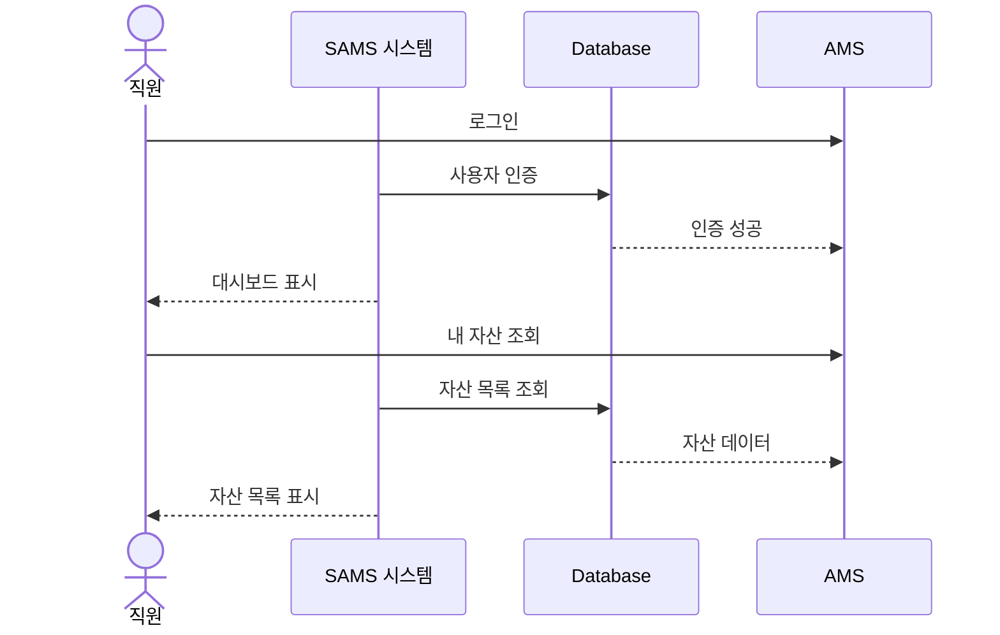
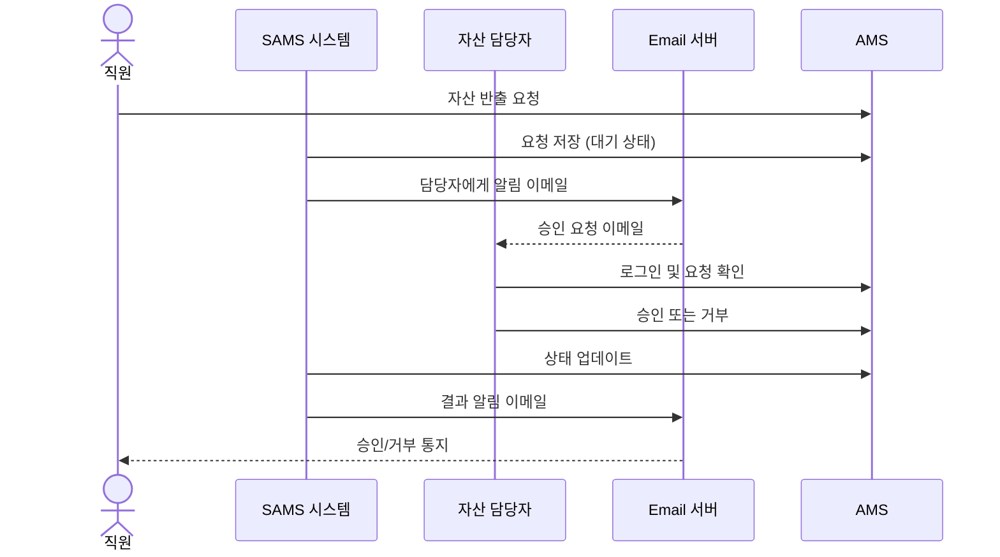
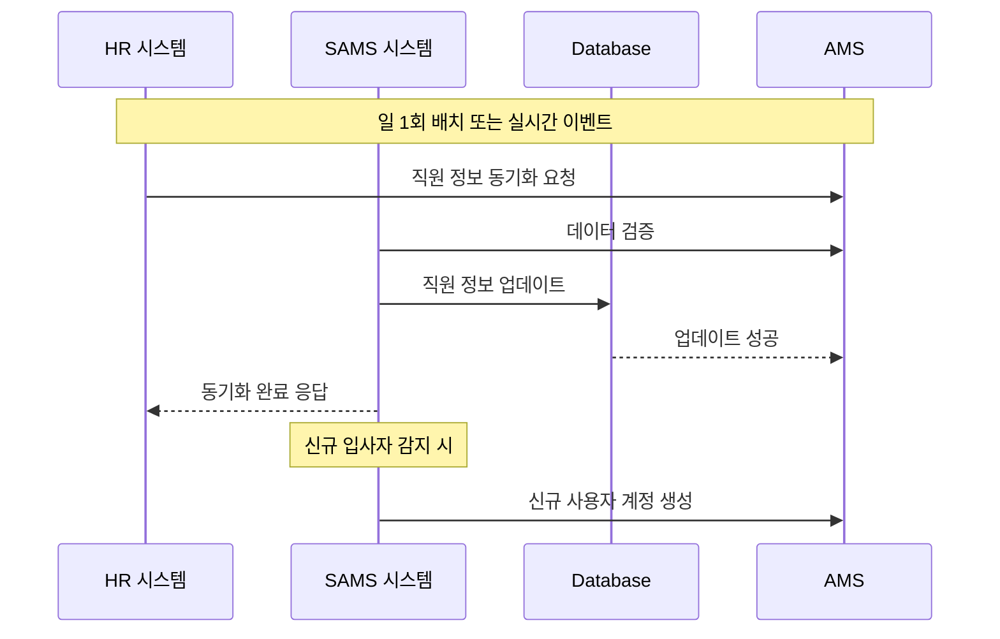
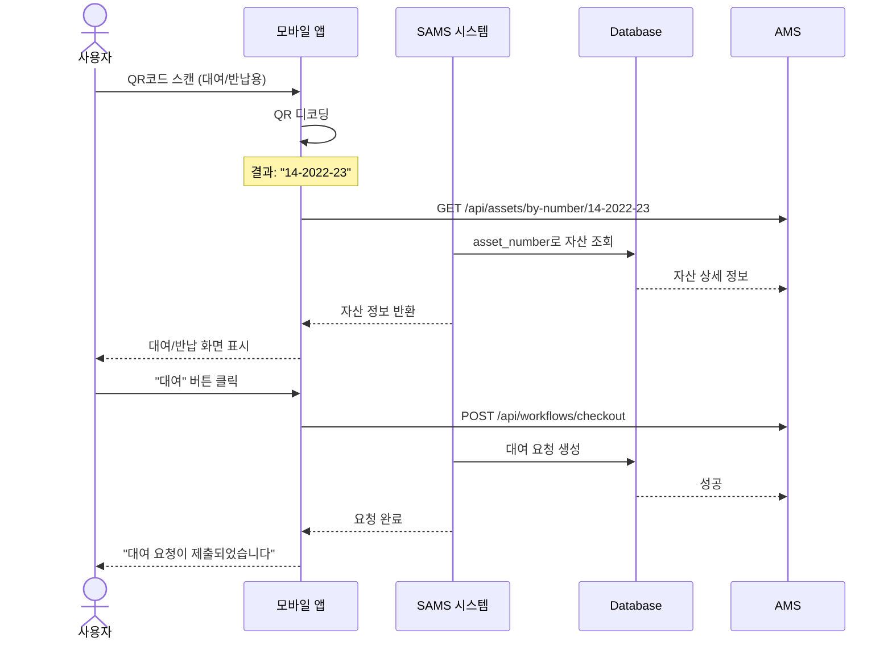

# System Context - C4 Model Level 1

## 📋 Overview

이 문서는 C4 모델의 레벨 1인 시스템 컨텍스트를 설명합니다. 자산관리 시스템(SAMS)과 외부 시스템, 사용자 간의 상호작용을 고수준에서 보여줍니다.

## 🎭 Actors (사용자 및 외부 시스템)

### Primary Users

#### 1. 직원 (Employee)
- **역할**: 일반 사용자
- **권한**:
  - 본인에게 배정된 자산 조회
  - 자산 반출/반납 요청
  - 자산 정보 확인 (QR코드 스캔)
- **사용 시나리오**:
  - 노트북 대여 요청
  - 모니터 추가 요청
  - 현재 보유 자산 확인

#### 2. 자산 담당자 (Asset Manager)
- **역할**: 자산 관리 책임자 (컬쳐앤인프라팀)
- **권한**:
  - 모든 자산 CRUD 작업
  - 반출/반납 요청 승인/거부
  - 자산 등록 및 폐기 처리
  - 자산 재배정 및 이동
  - 통계 및 리포트 생성
- **사용 시나리오**:
  - 신규 자산 등록
  - 입사자 장비 배정
  - 노후 장비 불용 처리
  - 재고 관리 및 실사

#### 3. 시스템 관리자 (System Admin)
- **역할**: IT 시스템 관리자
- **권한**:
  - 사용자 계정 관리
  - 권한 및 역할 설정
  - 시스템 설정 변경
  - 감사 로그 조회
  - 백업 및 복구
- **사용 시나리오**:
  - 신규 직원 계정 생성
  - 권한 부여 및 회수
  - 시스템 모니터링

### External Systems

#### 1. HR 시스템 (Human Resources System)
- **연동 목적**: 직원 정보 동기화
- **연동 데이터**:
  - 직원 기본 정보 (이름, 부서, 직급)
  - 입사/퇴사 정보
  - 조직도 정보
- **연동 방식**: REST API (단방향: HR → SAMS)
- **연동 주기**: 일 1회 배치 + 실시간 이벤트

#### 2. 구매 시스템 (Procurement System)
- **연동 목적**: 자산 구매 정보 자동 등록
- **연동 데이터**:
  - 구매 품의서 정보
  - 세금계산서 정보
  - 공급업체 정보
  - 구매 금액 및 날짜
- **연동 방식**: REST API (단방향: 구매 → SAMS)
- **연동 주기**: 실시간 또는 일 1회

#### 3. Email 시스템 (SMTP Server)
- **연동 목적**: 알림 및 통지 발송
- **알림 유형**:
  - 자산 배정 알림
  - 반출/반납 승인 결과
  - 자산 반납 기한 알림
  - 시스템 장애 알림
- **연동 방식**: SMTP
- **발송 주기**: 실시간 + 배치 (일일 요약)

#### 4. 모바일 디바이스 (Mobile Device)
- **연동 목적**: QR코드 스캔 및 모바일 접근
- **제공 기능**:
  - QR코드 스캔 (카메라)
  - 자산 조회
  - 반출/반납 요청
  - 푸시 알림 수신
- **연동 방식**: REST API, WebSocket
- **플랫폼**: iOS, Android (PWA)

#### 5. SSO/Active Directory (Optional)
- **연동 목적**: 통합 인증
- **연동 데이터**:
  - 사용자 인증 정보
  - 조직도 정보
- **연동 방식**: SAML 2.0 or OAuth 2.0
- **지원 여부**: Phase 2+

## 🏗️ System Context Diagram

```mermaid
graph TB
    subgraph "External Systems"
        HR[HR System<br/>직원 정보]
        PROC[Procurement System<br/>구매 정보]
        EMAIL[Email Server<br/>알림 발송]
        SSO[SSO/AD<br/>통합 인증]
    end

    subgraph "Users"
        EMP[직원<br/>Employee]
        MGR[자산 담당자<br/>Asset Manager]
        ADMIN[시스템 관리자<br/>System Admin]
        MOBILE[모바일 디바이스<br/>Mobile Device]
    end

    subgraph "SureSoft SAMS"
        SAMS[Asset Management<br/>System<br/>자산관리 시스템]
    end

    EMP -->|자산 조회, 반출/반납 요청| SAMS
    MGR -->|자산 관리, 승인 처리| SAMS
    ADMIN -->|시스템 관리, 권한 설정| SAMS
    MOBILE -->|QR 스캔, 모바일 접근| SAMS

    HR -->|직원 정보 동기화| SAMS
    PROC -->|구매 정보 전송| SAMS
    SAMS -->|알림 이메일 발송| EMAIL
    SSO -.->|인증 위임<br/>(Optional)| SAMS

    classDef systemStyle fill:#1168bd,stroke:#0b4884,color:#ffffff
    classDef userStyle fill:#08427b,stroke:#052e56,color:#ffffff
    classDef externalStyle fill:#999999,stroke:#6b6b6b,color:#ffffff

    class SAMS systemStyle
    class EMP,MGR,ADMIN,MOBILE userStyle
    class HR,PROC,EMAIL,SSO externalStyle
```

## 🔄 Key Interactions

### 1. 직원 자산 조회 프로세스


### 2. 자산 반출 요청 프로세스


### 3. HR 시스템 연동 프로세스


### 4. QR코드 스캔 프로세스 (모바일 - MVP)



## 🌐 System Boundaries

### In Scope (시스템 범위 내)
- ✅ 자산 생애주기 관리 (등록 → 배정 → 반납 → 폐기)
- ✅ 사용자 인증 및 권한 관리
- ✅ 반출/반납 워크플로우 및 승인 프로세스
- ✅ QR코드 스캔 기능 (MVP: 대여/반납용)
- ✅ 자산 검색, 필터링, 통계
- ✅ 알림 및 이메일 발송
- ✅ 대시보드 및 리포팅
- ✅ 감사 로그 및 이력 관리

### Out of Scope (시스템 범위 외)
- ❌ HR 직원 정보 관리 (HR 시스템에서 관리)
- ❌ 구매 프로세스 및 발주 (구매 시스템에서 관리)
- ❌ 재무 회계 처리 (재무 시스템에서 관리)
- ❌ 실시간 자산 위치 추적 (GPS, BLE 비콘 등 - Phase 3+)
- ❌ IoT 센서 연동 (온도, 습도 등 환경 모니터링 - Phase 3+)

### Future Scope (향후 확장 가능)
- 🔮 AI 기반 자산 수요 예측
- 🔮 자산 최적화 추천 엔진
- 🔮 블록체인 기반 자산 이력 검증
- 🔮 AR/VR 기반 자산 위치 안내
- 🔮 챗봇 기반 자산 요청 인터페이스

## 🔒 Trust Boundaries

### Level 1: Public Zone
- 외부 인터넷에서 접근 가능
- **포함 요소**: 없음 (모든 접근은 인증 필요)

### Level 2: DMZ (Demilitarized Zone)
- 방화벽으로 보호되는 준외부 영역
- **포함 요소**:
  - 리버스 프록시 (Nginx)
  - Load Balancer
  - WAF (Web Application Firewall)

### Level 3: Application Zone
- 내부 네트워크, 애플리케이션 서버 영역
- **포함 요소**:
  - SAMS 웹 서버
  - SAMS API 서버
  - Redis 캐시

### Level 4: Data Zone
- 최고 보안 수준, 데이터베이스 영역
- **포함 요소**:
  - PostgreSQL Database
  - 백업 스토리지
  - 감사 로그 스토리지

## 📊 Key Metrics and SLAs

### Performance Metrics
- **Response Time**: API 응답 시간 < 500ms (P95)
- **Throughput**: 초당 요청 처리 100 TPS 이상
- **Concurrent Users**: 동시 접속자 500명 이상 지원

### Availability Metrics
- **Uptime**: 99.9% 가동률 (월 43분 이하 다운타임)
- **MTTR**: 평균 복구 시간 < 1시간
- **MTBF**: 평균 장애 간격 > 720시간 (30일)

### Scalability Metrics
- **User Growth**: 연 100% 증가 대응 가능
- **Data Growth**: 연 50% 데이터 증가 대응 가능
- **Asset Capacity**: 10,000개 자산까지 성능 저하 없이 관리

## 🔗 Related Documents
- [Overview](./00-overview.md) - 아키텍처 개요
- [Container Architecture](./02-container-architecture.md) - C4 레벨 2
- [Security Architecture](./05-security-architecture.md) - 보안 상세 설계

## 📝 Version History

| Version | Date       | Author            | Changes                |
|---------|------------|-------------------|------------------------|
| 1.0.0   | 2025-10-29 | Architecture Team | Initial version        |
