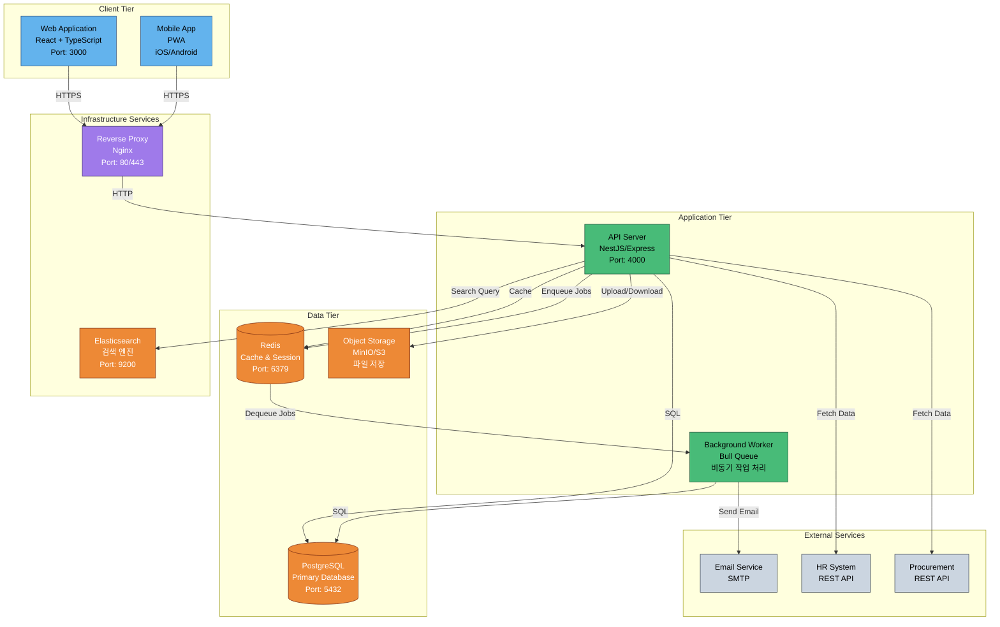
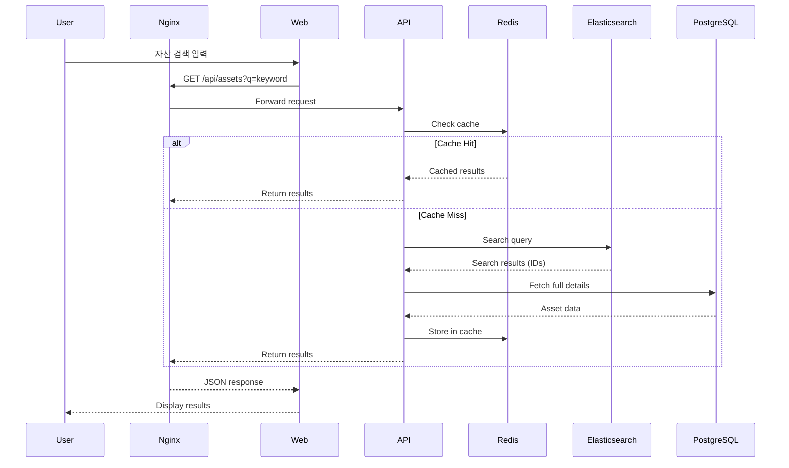
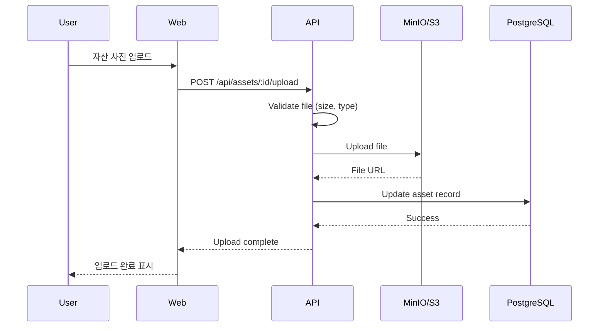
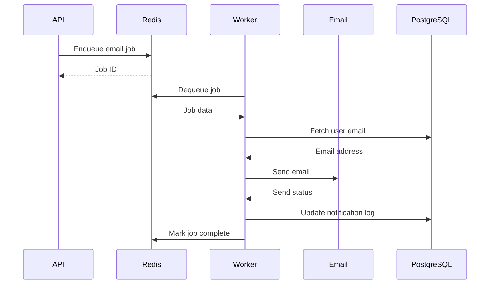

# Container Architecture - C4 Model Level 2

## 📋 Overview

이 문서는 C4 모델의 레벨 2인 컨테이너 아키텍처를 설명합니다. AMS 시스템을 구성하는 주요 컨테이너(애플리케이션, 데이터베이스, 서비스 등)와 그들 간의 상호작용을 보여줍니다.

## 🏗️ Container Architecture Diagram



## 📦 Container Descriptions

### 1. Web Application (Frontend)

**Technology**: React 18 + TypeScript + Vite

**Responsibilities**:
- 사용자 인터페이스 제공
- 클라이언트 사이드 라우팅
- 상태 관리 (Zustand/Redux)
- 폼 유효성 검증
- API 호출 및 에러 처리

**Key Features**:
- 반응형 디자인 (Desktop, Tablet, Mobile)
- PWA 지원 (오프라인 모드)
- 실시간 업데이트 (WebSocket)
- 국제화 (i18n) 지원 (한국어/영어)

**Dependencies**:
- API Server (REST/GraphQL)
- Reverse Proxy (Nginx)

**Deployment**:
- Static file hosting (Nginx, CDN)
- Docker container

---

### 2. Mobile App (Progressive Web App)

**Technology**: React Native or PWA

**Responsibilities**:
- 모바일 사용자 인터페이스
- QR코드 스캔 (카메라 접근)
- 푸시 알림 수신
- 오프라인 지원

**Key Features**:
- 네이티브 기능 접근 (카메라, 알림)
- 오프라인 우선 아키텍처
- 백그라운드 동기화
- 터치 최적화 UI

**Dependencies**:
- API Server
- Push Notification Service

**Deployment**:
- App Store (iOS)
- Google Play Store (Android)
- PWA (Web)

---

### 3. API Server (Backend)

**Technology**: NestJS (Node.js + TypeScript) or Express.js

**Responsibilities**:
- 비즈니스 로직 처리
- 데이터 유효성 검증
- 인증 및 권한 관리
- API 엔드포인트 제공
- 외부 시스템 연동

**Key Modules**:
- **Auth Module**: 로그인, JWT 발급, 권한 검증
- **Asset Module**: 자산 CRUD, 검색, 필터링
- **User Module**: 사용자 관리
- **Workflow Module**: 반출/반납 프로세스
- **Notification Module**: 알림 및 이메일 발송
- **Integration Module**: HR, 구매 시스템 연동
- **QRCode Module**: QR코드 생성 및 검증

**API Endpoints**:
- `POST /auth/login` - 로그인
- `GET /assets` - 자산 목록 조회
- `POST /assets` - 자산 등록
- `PUT /assets/:id` - 자산 수정
- `DELETE /assets/:id` - 자산 삭제
- `POST /workflow/checkout` - 반출 요청
- `POST /workflow/checkin` - 반납 요청
- `POST /workflow/approve` - 승인 처리
- `GET /qrcode/generate/:assetId` - QR코드 생성
- `GET /statistics/dashboard` - 대시보드 통계

**Dependencies**:
- PostgreSQL (데이터 저장)
- Redis (캐시, 세션)
- Elasticsearch (검색)
- MinIO/S3 (파일 저장)
- Email Service
- External APIs (HR, Procurement)

**Deployment**:
- Docker container
- Kubernetes Pod (Production)
- Auto-scaling (HPA)

---

### 4. Background Worker

**Technology**: Bull Queue (Node.js)

**Responsibilities**:
- 비동기 작업 처리
- 스케줄 작업 실행
- 대용량 데이터 처리
- 이메일 발송 큐 처리

**Job Types**:
- **Email Jobs**: 이메일 발송 (대량 발송 시)
- **Data Sync Jobs**: HR, 구매 시스템 데이터 동기화
- **Report Generation**: 통계 리포트 생성 (PDF, Excel)
- **Data Cleanup**: 오래된 로그 정리
- **Reminder Jobs**: 반납 기한 알림 발송

**Queue Configuration**:
- **High Priority**: 실시간 알림 (지연 < 1분)
- **Normal Priority**: 일반 작업 (지연 < 5분)
- **Low Priority**: 배치 작업 (지연 < 1시간)

**Dependencies**:
- Redis (Job Queue)
- PostgreSQL (데이터 접근)
- Email Service

**Deployment**:
- Docker container
- Separate deployment from API Server
- Auto-scaling based on queue length

---

### 5. PostgreSQL Database

**Technology**: PostgreSQL 15+

**Responsibilities**:
- 영구 데이터 저장
- 트랜잭션 관리
- 데이터 무결성 보장
- 복잡한 쿼리 처리

**Key Schemas**:
- **users**: 사용자 정보
- **assets**: 자산 정보
- **asset_history**: 자산 이력
- **workflows**: 반출/반납 워크플로우
- **approvals**: 승인 내역
- **audit_logs**: 감사 로그
- **categories**: 자산 카테고리
- **locations**: 위치 정보

**Performance Optimizations**:
- 인덱스 최적화 (B-Tree, GIN)
- 파티셔닝 (날짜 기반, 자산 유형 기반)
- 쿼리 최적화 (EXPLAIN ANALYZE)
- Connection Pooling (PgBouncer)

**Backup Strategy**:
- 일일 전체 백업 (Full Backup)
- 시간별 증분 백업 (Incremental)
- WAL 아카이빙 (Point-in-Time Recovery)
- 백업 보관: 30일

**High Availability**:
- Primary-Replica 구성
- Automatic Failover (Patroni)
- Read Replica (읽기 부하 분산)

---

### 6. Redis Cache

**Technology**: Redis 7+

**Responsibilities**:
- 세션 저장 (JWT Refresh Token)
- 애플리케이션 캐시
- Job Queue (Bull)
- Rate Limiting
- Real-time Data (WebSocket 상태)

**Data Structures**:
- **String**: 단순 캐시 (자산 상세 정보)
- **Hash**: 사용자 세션
- **List**: Job Queue
- **Set**: 온라인 사용자 목록
- **Sorted Set**: 리더보드, 순위

**Caching Strategy**:
- **Cache-Aside**: 읽기 중심 데이터
- **Write-Through**: 쓰기 중심 데이터
- **TTL**: 5분 ~ 1시간 (데이터 유형별)

**Persistence**:
- RDB Snapshot (매 6시간)
- AOF (Append-Only File)

---

### 7. Object Storage (MinIO/S3)

**Technology**: MinIO (Self-hosted) or AWS S3

**Responsibilities**:
- 이미지 파일 저장 (자산 사진)
- 첨부 파일 저장 (영수증, 문서)
- QR코드 이미지 저장
- 리포트 파일 저장 (PDF, Excel)

**Bucket Structure**:
- `assets/images/` - 자산 사진
- `assets/qrcodes/` - QR코드 이미지
- `documents/receipts/` - 영수증
- `reports/` - 생성된 리포트
- `backups/` - 데이터베이스 백업

**Access Control**:
- Pre-signed URLs (임시 접근 권한)
- IAM 정책 (서비스별 접근 제한)
- 암호화: Server-Side Encryption (SSE-S3)

---

### 8. Elasticsearch (Optional)

**Technology**: Elasticsearch 8+

**Responsibilities**:
- 전문 검색 (Full-Text Search)
- 자산 통합 검색
- 로그 검색 및 분석
- 통계 집계 (Aggregation)

**Indexed Data**:
- 자산 정보 (제목, 설명, 모델명 등)
- 사용자 정보
- 감사 로그

**Search Features**:
- 자동 완성 (Autocomplete)
- 퍼지 검색 (Fuzzy Search)
- 다국어 검색 (한글, 영어)
- 필터링 및 정렬

**Data Sync**:
- Logstash or Custom ETL
- 실시간 동기화 (Change Data Capture)

---

### 9. Nginx Reverse Proxy

**Technology**: Nginx 1.24+

**Responsibilities**:
- TLS/SSL 종료
- 로드 밸런싱
- 정적 파일 서빙
- Rate Limiting
- 압축 (Gzip, Brotli)
- 보안 헤더 추가

**Configuration Highlights**:
```nginx
upstream api_backend {
    least_conn;
    server api-server-1:4000;
    server api-server-2:4000;
}

server {
    listen 443 ssl http2;
    server_name ams.suresoft.com;

    ssl_certificate /etc/nginx/ssl/cert.pem;
    ssl_certificate_key /etc/nginx/ssl/key.pem;

    location / {
        root /usr/share/nginx/html;
        try_files $uri $uri/ /index.html;
    }

    location /api/ {
        proxy_pass http://api_backend;
        proxy_set_header X-Real-IP $remote_addr;
        proxy_set_header X-Forwarded-For $proxy_add_x_forwarded_for;
    }
}
```

---

## 🔄 Container Interactions

### Request Flow: Asset Search



### Request Flow: File Upload



### Background Job Flow: Email Notification



## 📊 Technology Decisions

### Why NestJS for Backend?
- ✅ TypeScript 기본 지원
- ✅ 모듈화된 아키텍처
- ✅ Dependency Injection
- ✅ 풍부한 생태계 (Passport, TypeORM, Bull 등)
- ✅ OpenAPI 자동 생성
- ✅ 테스트 친화적

### Why PostgreSQL?
- ✅ ACID 트랜잭션 보장
- ✅ 복잡한 쿼리 지원 (JOIN, Aggregation)
- ✅ JSON 데이터 타입 지원
- ✅ 강력한 인덱싱 (B-Tree, GIN, GiST)
- ✅ 확장 기능 (PostGIS, Full-Text Search)
- ✅ 오픈소스, 무료

### Why Redis?
- ✅ 초고속 인메모리 저장소
- ✅ 다양한 데이터 구조 지원
- ✅ Pub/Sub 메시징
- ✅ Job Queue 기능 (Bull)
- ✅ 세션 스토어로 적합

### Why Elasticsearch? (Optional)
- ✅ 강력한 전문 검색 기능
- ✅ 실시간 검색 및 분석
- ✅ 수평 확장 용이
- ⚠️ 단점: 운영 복잡도 증가, 리소스 소모

## 🔗 Related Documents
- [Overview](./00-overview.md)
- [System Context](./01-system-context.md)
- [Component Architecture](./03-component-architecture.md)
- [Deployment Architecture](./06-deployment-architecture.md)

## 📝 Version History

| Version | Date       | Author            | Changes                |
|---------|------------|-------------------|------------------------|
| 1.0.0   | 2025-10-29 | Architecture Team | Initial version        |
