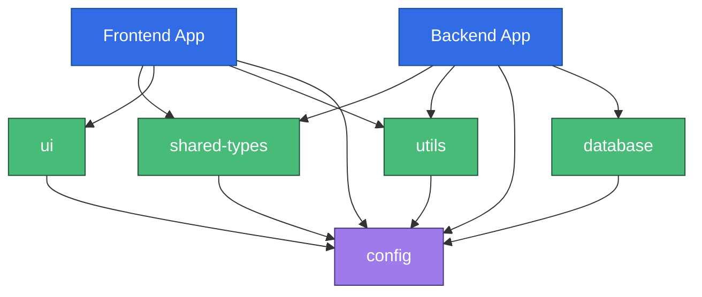

# Project Structure - Turborepo Monorepo

## 📋 Overview

SureSoft AMS는 Turborepo 기반 모노레포 구조로 구성되어 있습니다. 프론트엔드와 백엔드가 단일 저장소에서 관리되며, 공유 코드는 별도의 패키지로 분리되어 있습니다.

## 🏗️ Directory Structure

```
suresoft-ams/
├── apps/                          # 애플리케이션
│   ├── frontend/                  # React 프론트엔드
│   │   ├── src/
│   │   │   ├── components/        # UI 컴포넌트
│   │   │   ├── pages/             # 페이지 컴포넌트
│   │   │   ├── hooks/             # Custom Hooks
│   │   │   ├── services/          # API 서비스
│   │   │   ├── stores/            # Zustand 스토어
│   │   │   ├── utils/             # 유틸리티
│   │   │   ├── styles/            # 전역 스타일
│   │   │   ├── assets/            # 정적 파일
│   │   │   └── main.tsx           # 엔트리 포인트
│   │   ├── public/                # Public 파일
│   │   ├── index.html
│   │   ├── vite.config.ts
│   │   ├── tsconfig.json
│   │   └── package.json
│   │
│   └── backend/                   # NestJS 백엔드
│       ├── src/
│       │   ├── modules/           # 기능별 모듈
│       │   │   ├── auth/          # 인증/인가
│       │   │   ├── users/         # 사용자 관리
│       │   │   ├── assets/        # 자산 관리
│       │   │   ├── workflows/     # 워크플로우
│       │   │   ├── locations/     # 위치 관리
│       │   │   ├── qrcode/        # QR코드
│       │   │   └── reports/       # 리포트
│       │   ├── common/            # 공통 모듈
│       │   │   ├── decorators/    # 커스텀 데코레이터
│       │   │   ├── filters/       # Exception 필터
│       │   │   ├── guards/        # Guards
│       │   │   ├── interceptors/  # Interceptors
│       │   │   └── pipes/         # Validation Pipes
│       │   ├── config/            # 설정
│       │   ├── main.ts            # 엔트리 포인트
│       │   └── app.module.ts
│       ├── test/
│       ├── prisma/                # Prisma 스키마
│       ├── tsconfig.json
│       └── package.json
│
├── packages/                      # 공유 패키지
│   ├── shared-types/              # 공유 타입 정의
│   │   ├── src/
│   │   │   ├── asset/             # 자산 관련 타입
│   │   │   ├── user/              # 사용자 관련 타입
│   │   │   ├── workflow/          # 워크플로우 관련 타입
│   │   │   ├── common/            # 공통 타입
│   │   │   └── index.ts
│   │   ├── tsconfig.json
│   │   └── package.json
│   │
│   ├── ui/                        # 공유 UI 컴포넌트
│   │   ├── src/
│   │   │   ├── Button/
│   │   │   ├── Input/
│   │   │   ├── Modal/
│   │   │   ├── Table/
│   │   │   └── index.ts
│   │   ├── tsconfig.json
│   │   └── package.json
│   │
│   ├── utils/                     # 공유 유틸리티
│   │   ├── src/
│   │   │   ├── date.ts            # 날짜 유틸
│   │   │   ├── validation.ts      # 유효성 검증
│   │   │   ├── format.ts          # 포맷팅
│   │   │   ├── constants.ts       # 상수
│   │   │   └── index.ts
│   │   ├── tsconfig.json
│   │   └── package.json
│   │
│   ├── config/                    # 공유 설정
│   │   ├── typescript/            # TypeScript 설정
│   │   │   ├── base.json
│   │   │   ├── react.json
│   │   │   └── node.json
│   │   ├── eslint/                # ESLint 설정
│   │   │   ├── base.js
│   │   │   ├── react.js
│   │   │   └── node.js
│   │   └── package.json
│   │
│   └── database/                  # Prisma 클라이언트
│       ├── prisma/
│       │   └── schema.prisma
│       ├── src/
│       │   └── index.ts           # Prisma Client export
│       ├── tsconfig.json
│       └── package.json
│
├── docs/                          # 문서
│   ├── architecture/              # 아키텍처 문서
│   │   ├── diagrams/              # Mermaid 다이어그램
│   │   ├── adr/                   # Architecture Decision Records
│   │   └── api/                   # API 문서
│   └── guides/                    # 가이드 문서
│
├── scripts/                       # 유틸리티 스크립트
│   ├── migrate-excel.py           # Excel 데이터 마이그레이션
│   ├── generate-qr.ts             # QR코드 일괄 생성
│   └── seed.ts                    # 시드 데이터
│
├── .github/                       # GitHub 설정
│   └── workflows/                 # CI/CD Workflows
│       ├── ci.yml
│       ├── deploy.yml
│       └── docs.yml
│
├── docker/                        # Docker 설정
│   ├── frontend.Dockerfile
│   ├── backend.Dockerfile
│   └── nginx.conf
│
├── k8s/                           # Kubernetes 매니페스트
│   ├── base/
│   └── overlays/
│       ├── dev/
│       ├── staging/
│       └── production/
│
├── turbo.json                     # Turborepo 설정
├── pnpm-workspace.yaml            # pnpm workspace 설정
├── package.json                   # Root package.json
├── .gitignore
├── .prettierrc
├── .editorconfig
├── docker-compose.yml
└── README.md
```

## 📦 Package Overview

### Applications (`apps/`)

#### 1. Frontend (@ams/frontend)
- **Framework**: React 18 + TypeScript + Vite
- **State Management**: Zustand
- **UI Library**: Material-UI (MUI)
- **Routing**: React Router v6
- **API Client**: Axios + React Query

**Key Features**:
- 반응형 디자인
- PWA 지원
- QR코드 스캔
- 실시간 업데이트 (WebSocket)

**Dependencies**:
```json
{
  "@ams/shared-types": "workspace:*",
  "@ams/ui": "workspace:*",
  "@ams/utils": "workspace:*"
}
```

#### 2. Backend (@ams/backend)
- **Framework**: NestJS + TypeScript
- **ORM**: Prisma
- **Validation**: class-validator
- **Authentication**: Passport.js + JWT

**Module Structure**:
- Each module follows NestJS best practices
- Controllers, Services, Entities, DTOs
- Unit tests alongside each file

**Dependencies**:
```json
{
  "@ams/shared-types": "workspace:*",
  "@ams/utils": "workspace:*",
  "@ams/database": "workspace:*"
}
```

### Shared Packages (`packages/`)

#### 1. @ams/shared-types
**Purpose**: 공유 TypeScript 타입 정의

**Exports**:
- Asset types (Asset, AssetStatus, CreateAssetDto, etc.)
- User types (User, UserRole, LoginDto, etc.)
- Workflow types (Workflow, WorkflowStatus, etc.)
- Common types (ApiResponse, PaginatedResponse, etc.)

**Usage**:
```typescript
// Frontend
import { Asset, AssetStatus } from '@ams/shared-types';

// Backend
import { CreateAssetDto } from '@ams/shared-types';
```

**Benefits**:
- ✅ 타입 동기화 자동화
- ✅ API 계약 보장
- ✅ 중복 제거

#### 2. @ams/ui
**Purpose**: 공유 UI 컴포넌트 라이브러리

**Components**:
- Button, Input, Select, Checkbox
- Modal, Dialog, Drawer
- Table, DataGrid
- Card, Badge, Chip
- Loading, Skeleton

**Features**:
- MUI 기반 커스터마이징
- Storybook 문서화
- 접근성 (a11y) 준수
- 다크모드 지원

#### 3. @ams/utils
**Purpose**: 공유 유틸리티 함수

**Modules**:
- `date.ts`: 날짜 포맷팅, 계산
- `validation.ts`: 유효성 검증 (이메일, 전화번호 등)
- `format.ts`: 숫자, 통화, 자산번호 포맷
- `constants.ts`: 공통 상수

**Example**:
```typescript
import { formatAssetTag, calculateGrade } from '@ams/utils';

const tag = formatAssetTag('11', '2024', 1); // "SRS-11-2024-0001"
const grade = calculateGrade(new Date('2023-01-01')); // "A"
```

#### 4. @ams/config
**Purpose**: 공유 설정 파일

**Configurations**:
- TypeScript (base, react, node)
- ESLint (base, react, node)
- Prettier

**Usage**:
```json
// apps/frontend/tsconfig.json
{
  "extends": "@ams/config/typescript/react.json"
}
```

#### 5. @ams/database
**Purpose**: Prisma Client 및 스키마

**Structure**:
```
packages/database/
├── prisma/
│   └── schema.prisma    # 데이터베이스 스키마
├── src/
│   └── index.ts         # Prisma Client export
└── package.json
```

**Usage**:
```typescript
// Backend only
import { prisma } from '@ams/database';

const assets = await prisma.asset.findMany();
```

## 🔄 Dependency Graph



## 🚀 Development Workflow

### Starting Development

```bash
# Install dependencies
pnpm install

# Start all apps in dev mode
pnpm dev

# Start specific app
pnpm dev --filter=@ams/frontend
pnpm dev --filter=@ams/backend
```

### Building

```bash
# Build all packages and apps
pnpm build

# Build specific package
pnpm build --filter=@ams/shared-types

# Build with dependencies
pnpm build --filter=@ams/frontend...
```

### Testing

```bash
# Run all tests
pnpm test

# Run tests for changed packages only
pnpm test --filter=[HEAD^1]

# Run tests in watch mode
pnpm test:watch --filter=@ams/backend
```

### Linting

```bash
# Lint all packages
pnpm lint

# Lint and fix
pnpm lint --fix
```

## 📝 Adding New Packages

### Create Shared Package

```bash
# 1. Create package directory
mkdir -p packages/new-package/src

# 2. Create package.json
cat > packages/new-package/package.json <<EOF
{
  "name": "@ams/new-package",
  "version": "1.0.0",
  "main": "./dist/index.js",
  "types": "./dist/index.d.ts",
  "scripts": {
    "build": "tsc",
    "dev": "tsc --watch",
    "clean": "rm -rf dist"
  },
  "devDependencies": {
    "@ams/config": "workspace:*",
    "typescript": "^5.3.0"
  }
}
EOF

# 3. Create tsconfig.json
cat > packages/new-package/tsconfig.json <<EOF
{
  "extends": "@ams/config/typescript/base.json",
  "compilerOptions": {
    "outDir": "./dist",
    "rootDir": "./src"
  }
}
EOF

# 4. Add to pnpm-workspace.yaml (already included by 'packages/*')

# 5. Create source files
echo "export const hello = 'world';" > packages/new-package/src/index.ts

# 6. Build
pnpm build --filter=@ams/new-package
```

### Use in Apps

```json
// apps/frontend/package.json
{
  "dependencies": {
    "@ams/new-package": "workspace:*"
  }
}
```

```typescript
// apps/frontend/src/App.tsx
import { hello } from '@ams/new-package';
```

## 🎯 Best Practices

### 1. Package Naming Convention
- Use `@ams/` scope for all packages
- Use kebab-case: `@ams/shared-types`
- Descriptive names: `ui`, `utils`, `database`

### 2. Import Paths
```typescript
// ✅ Good - Use package name
import { Asset } from '@ams/shared-types';

// ❌ Bad - Relative path across packages
import { Asset } from '../../packages/shared-types/src';
```

### 3. Circular Dependencies
Avoid circular dependencies between packages:
```
✅ frontend → shared-types → config
❌ shared-types → utils → shared-types (circular!)
```

### 4. Versioning
- Use `workspace:*` for internal dependencies
- Actual versions only for external dependencies

### 5. Build Order
Turborepo automatically handles build order based on `dependsOn`:
```json
// turbo.json
{
  "pipeline": {
    "build": {
      "dependsOn": ["^build"]  // Build dependencies first
    }
  }
}
```

## 🔗 Related Documents
- [ADR-0004: Turborepo Monorepo](./adr/0004-turborepo-monorepo.md)
- [Container Architecture](./02-container-architecture.md)
- [Overview](./00-overview.md)

## 📝 Version History

| Version | Date       | Author            | Changes                |
|---------|------------|-------------------|------------------------|
| 1.0.0   | 2025-10-29 | Architecture Team | Initial version        |
