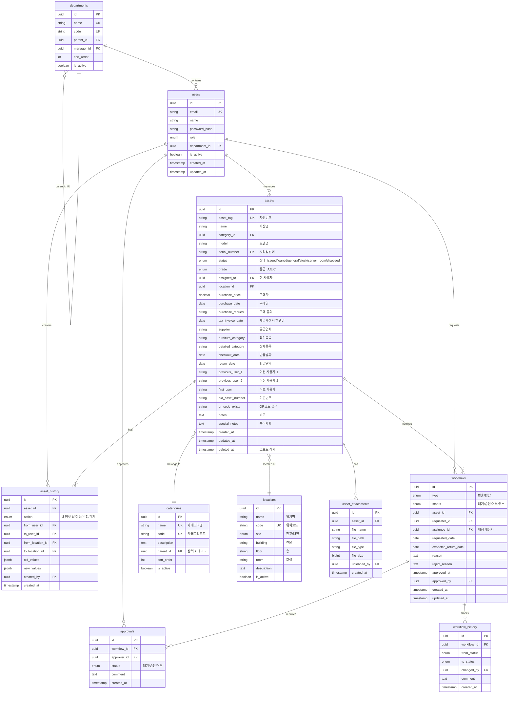

# Data Architecture

## 📋 Overview

이 문서는 자산관리 시스템(SAMS)의 데이터 아키텍처를 설명합니다. 데이터베이스 스키마, 데이터 모델, 관계, 인덱싱 전략, 데이터 마이그레이션 계획을 포함합니다.

## 🗄️ Database Schema

### Entity Relationship Diagram (ERD)



## 📋 Core Tables

### 1. users (사용자)

사용자 계정 및 인증 정보를 저장합니다.

```sql
CREATE TABLE users (
    id UUID PRIMARY KEY DEFAULT gen_random_uuid(),
    email VARCHAR(255) NOT NULL UNIQUE,
    name VARCHAR(100) NOT NULL,
    password_hash VARCHAR(255) NOT NULL,
    role VARCHAR(20) NOT NULL CHECK (role IN ('admin', 'manager', 'employee')),
    department_id UUID REFERENCES departments(id),
    phone VARCHAR(20),
    avatar_url TEXT,
    is_active BOOLEAN DEFAULT true,
    last_login_at TIMESTAMP,
    created_at TIMESTAMP DEFAULT CURRENT_TIMESTAMP,
    updated_at TIMESTAMP DEFAULT CURRENT_TIMESTAMP
);

CREATE INDEX idx_users_email ON users(email);
CREATE INDEX idx_users_department ON users(department_id);
CREATE INDEX idx_users_role ON users(role);
```

**Constraints**:
- `email`: 중복 불가, 유효한 이메일 형식
- `role`: admin (관리자), manager (자산담당자), employee (일반직원)

---

### 2. assets (자산)

IT 자산의 기본 정보를 저장합니다.

```sql
CREATE TYPE asset_status AS ENUM (
    'issued',       -- [지급장비] 직원에게 지급된 장비
    'loaned',       -- [대여용] 대여 가능한 장비
    'general',      -- [일반장비] 일반 사용 장비
    'stock',        -- [재고] 재고/보관 중
    'server_room',  -- [서버실] 서버실 장비
    'disposed'      -- [불용] 폐기/불용 처리
);

CREATE TYPE asset_grade AS ENUM ('A', 'B', 'C');

CREATE TABLE assets (
    id UUID PRIMARY KEY DEFAULT gen_random_uuid(),
    asset_tag VARCHAR(50) NOT NULL UNIQUE,  -- 자산번호 (예: SRS-11-2024-0001)
    name VARCHAR(200) NOT NULL,  -- 자산명
    category_id UUID NOT NULL REFERENCES categories(id),
    model VARCHAR(200),  -- 규격/모델명
    serial_number VARCHAR(100) UNIQUE,  -- MAC 또는 시리얼넘버
    status asset_status DEFAULT 'stock',
    grade asset_grade,
    assigned_to UUID REFERENCES users(id),  -- 현 사용자
    location_id UUID REFERENCES locations(id),
    
    -- 구매 정보
    purchase_price DECIMAL(12, 2),  -- 구매가
    purchase_date DATE,  -- 구매연일
    purchase_request VARCHAR(100),  -- 구매 품의
    tax_invoice_date DATE,  -- 세금계산서 발행일
    supplier VARCHAR(200),  -- 구매처
    
    -- 분류 정보
    furniture_category VARCHAR(50),  -- 집기품목
    detailed_category VARCHAR(50),  -- 상세품목
    
    -- 반출/반납 정보
    checkout_date DATE,  -- 반출날짜
    return_date DATE,  -- 반납날짜
    
    -- 사용자 이력
    previous_user_1 VARCHAR(100),  -- 이전 사용자 1
    previous_user_2 VARCHAR(100),  -- 이전 사용자 2
    first_user VARCHAR(100),  -- 최초 사용자
    
    -- 기타 정보
    old_asset_number VARCHAR(50),  -- 기존번호
    qr_code_exists VARCHAR(10),  -- QR코드 유무
    notes TEXT,  -- 비고
    special_notes TEXT,  -- 특이사항

    created_at TIMESTAMP DEFAULT CURRENT_TIMESTAMP,
    updated_at TIMESTAMP DEFAULT CURRENT_TIMESTAMP,
    deleted_at TIMESTAMP  -- 소프트 삭제
);

CREATE INDEX idx_assets_tag ON assets(asset_tag);
CREATE INDEX idx_assets_category ON assets(category_id);
CREATE INDEX idx_assets_status ON assets(status);
CREATE INDEX idx_assets_assigned_to ON assets(assigned_to);
CREATE INDEX idx_assets_location ON assets(location_id);
CREATE INDEX idx_assets_serial ON assets(serial_number);
CREATE INDEX idx_assets_deleted ON assets(deleted_at) WHERE deleted_at IS NULL;
```

**Business Rules**:

- **자산번호 (asset_tag)**: 형식: `SRS-{CATEGORY}-{YEAR}-{SEQ}` (예: `SRS-11-2024-0001`)
  - 기존 QR코드에 이미 인코딩되어 있음
  - QR 스캔 시 이 값으로 자산 조회

- **상태 (status)**: 6가지 실제 상태
  - `issued` [지급장비]: 직원에게 지급된 장비 (1,053건)
  - `loaned` [대여용]: 대여 가능한 장비 (769건)
  - `disposed` [불용]: 폐기/불용 처리 (211건)
  - `general` [일반장비]: 일반 사용 장비 (129건)
  - `server_room` [서버실]: 서버실 장비 (32건)
  - `stock` [재고]: 재고/보관 중 (29건)

- **등급 (grade)**: 구매 연도 기반 자동 계산
  - A급: 2022년 이후 구매
  - B급: 2018~2021년 구매
  - C급: 2017년 이전 구매

- **Excel 마이그레이션**: 모든 23개 컬럼 보존
  - 원본 데이터 무손실 마이그레이션 완료 (2,223건)
  - 데스크탑(11): 497건
  - 노트북(12): 700건
  - 모니터(14): 1,026건

---

### 3. categories (카테고리)

자산 분류 체계를 저장합니다.

```sql
CREATE TABLE categories (
    id UUID PRIMARY KEY DEFAULT gen_random_uuid(),
    name VARCHAR(100) NOT NULL UNIQUE,
    code VARCHAR(20) NOT NULL UNIQUE,
    description TEXT,
    parent_id UUID REFERENCES categories(id),
    sort_order INT DEFAULT 0,
    is_active BOOLEAN DEFAULT true,
    created_at TIMESTAMP DEFAULT CURRENT_TIMESTAMP,
    updated_at TIMESTAMP DEFAULT CURRENT_TIMESTAMP
);

CREATE INDEX idx_categories_parent ON categories(parent_id);
CREATE INDEX idx_categories_code ON categories(code);
```

**Initial Data**:
```sql
INSERT INTO categories (name, code, description) VALUES
    ('데스크탑', '11', 'Desktop computers'),
    ('노트북', '12', 'Laptop computers'),
    ('태블릿', '13', 'Tablet devices'),
    ('모니터', '14', 'Display monitors'),
    ('주변기기', '15', 'Peripherals');
```

---

### 4. locations (위치)

자산이 보관되거나 사용되는 물리적 위치 정보를 저장합니다.

```sql
CREATE TYPE location_site AS ENUM ('pangyo', 'daejeon');

CREATE TABLE locations (
    id UUID PRIMARY KEY DEFAULT gen_random_uuid(),
    name VARCHAR(100) NOT NULL,
    code VARCHAR(20) NOT NULL UNIQUE,
    site location_site NOT NULL,
    building VARCHAR(50),
    floor VARCHAR(10),
    room VARCHAR(50),
    description TEXT,
    is_active BOOLEAN DEFAULT true,
    created_at TIMESTAMP DEFAULT CURRENT_TIMESTAMP,
    updated_at TIMESTAMP DEFAULT CURRENT_TIMESTAMP
);

CREATE INDEX idx_locations_code ON locations(code);
CREATE INDEX idx_locations_site ON locations(site);
```

---

### 5. asset_history (자산 이력)

자산의 모든 변경 사항을 추적합니다.

```sql
CREATE TYPE history_action AS ENUM ('create', 'update', 'assign', 'unassign', 'relocate', 'dispose', 'restore');

CREATE TABLE asset_history (
    id UUID PRIMARY KEY DEFAULT gen_random_uuid(),
    asset_id UUID NOT NULL REFERENCES assets(id),
    action history_action NOT NULL,
    from_user_id UUID REFERENCES users(id),
    to_user_id UUID REFERENCES users(id),
    from_location_id UUID REFERENCES locations(id),
    to_location_id UUID REFERENCES locations(id),
    old_values JSONB,
    new_values JSONB,
    created_by UUID NOT NULL REFERENCES users(id),
    created_at TIMESTAMP DEFAULT CURRENT_TIMESTAMP
);

CREATE INDEX idx_history_asset ON asset_history(asset_id);
CREATE INDEX idx_history_created_at ON asset_history(created_at DESC);
CREATE INDEX idx_history_action ON asset_history(action);
CREATE INDEX idx_history_user ON asset_history(to_user_id);
```

**JSONB Structure Example**:
```json
{
  "old_values": {
    "status": "stock",
    "location_id": "uuid-1"
  },
  "new_values": {
    "status": "issued",
    "location_id": "uuid-2",
    "assigned_to": "uuid-3"
  }
}
```

---

### 6. workflows (워크플로우)

반출/반납 요청 및 승인 프로세스를 관리합니다.

```sql
CREATE TYPE workflow_type AS ENUM ('checkout', 'checkin');
CREATE TYPE workflow_status AS ENUM ('pending', 'approved', 'rejected', 'cancelled');

CREATE TABLE workflows (
    id UUID PRIMARY KEY DEFAULT gen_random_uuid(),
    type workflow_type NOT NULL,
    status workflow_status DEFAULT 'pending',
    asset_id UUID NOT NULL REFERENCES assets(id),
    requester_id UUID NOT NULL REFERENCES users(id),
    assignee_id UUID REFERENCES users(id),
    requested_date DATE DEFAULT CURRENT_DATE,
    expected_return_date DATE,
    actual_return_date DATE,
    reason TEXT,
    reject_reason TEXT,
    approved_at TIMESTAMP,
    approved_by UUID REFERENCES users(id),
    created_at TIMESTAMP DEFAULT CURRENT_TIMESTAMP,
    updated_at TIMESTAMP DEFAULT CURRENT_TIMESTAMP
);

CREATE INDEX idx_workflows_asset ON workflows(asset_id);
CREATE INDEX idx_workflows_requester ON workflows(requester_id);
CREATE INDEX idx_workflows_status ON workflows(status);
CREATE INDEX idx_workflows_type ON workflows(type);
CREATE INDEX idx_workflows_created ON workflows(created_at DESC);
```

---

### 7. approvals (승인 내역)

워크플로우의 승인 단계를 관리합니다.

```sql
CREATE TABLE approvals (
    id UUID PRIMARY KEY DEFAULT gen_random_uuid(),
    workflow_id UUID NOT NULL REFERENCES workflows(id) ON DELETE CASCADE,
    approver_id UUID NOT NULL REFERENCES users(id),
    status workflow_status DEFAULT 'pending',
    comment TEXT,
    created_at TIMESTAMP DEFAULT CURRENT_TIMESTAMP,
    updated_at TIMESTAMP DEFAULT CURRENT_TIMESTAMP
);

CREATE INDEX idx_approvals_workflow ON approvals(workflow_id);
CREATE INDEX idx_approvals_approver ON approvals(approver_id);
CREATE INDEX idx_approvals_status ON approvals(status);
```

---

### 8. departments (부서)

조직 구조를 저장합니다.

```sql
CREATE TABLE departments (
    id UUID PRIMARY KEY DEFAULT gen_random_uuid(),
    name VARCHAR(100) NOT NULL UNIQUE,
    code VARCHAR(20) NOT NULL UNIQUE,
    parent_id UUID REFERENCES departments(id),
    manager_id UUID REFERENCES users(id),
    sort_order INT DEFAULT 0,
    is_active BOOLEAN DEFAULT true,
    created_at TIMESTAMP DEFAULT CURRENT_TIMESTAMP,
    updated_at TIMESTAMP DEFAULT CURRENT_TIMESTAMP
);

CREATE INDEX idx_departments_parent ON departments(parent_id);
CREATE INDEX idx_departments_code ON departments(code);
```

---

### 9. asset_attachments (첨부파일)

자산 관련 파일(사진, 영수증 등)을 관리합니다.

```sql
CREATE TABLE asset_attachments (
    id UUID PRIMARY KEY DEFAULT gen_random_uuid(),
    asset_id UUID NOT NULL REFERENCES assets(id) ON DELETE CASCADE,
    file_name VARCHAR(255) NOT NULL,
    file_path TEXT NOT NULL,
    file_type VARCHAR(50),
    file_size BIGINT,
    uploaded_by UUID NOT NULL REFERENCES users(id),
    created_at TIMESTAMP DEFAULT CURRENT_TIMESTAMP
);

CREATE INDEX idx_attachments_asset ON asset_attachments(asset_id);
CREATE INDEX idx_attachments_uploader ON asset_attachments(uploaded_by);
```

---

## 🔄 Data Migration Strategy

### Phase 1: Excel Data Import (완료)

Excel 파일(`자산관리 데이터(슈커톤).xlsx`)에서 PostgreSQL로 데이터를 마이그레이션했습니다.

**마이그레이션 완료 상태**:
- ✅ 2,223개 자산 데이터 마이그레이션 완료
- ✅ 23개 Excel 컬럼 전체 보존 (무손실)
- ✅ 6가지 실제 상태 enum 적용
- ✅ 자동 등급(A/B/C) 계산
- ✅ 카테고리 및 위치 마스터 데이터 생성
- ✅ 사용자 데이터 매핑

**Migration Script**: `apps/backend/scripts/migrate_excel.py`

**주요 기능**:
1. **데이터 정제**
   - 공백 제거 및 NULL 처리
   - 날짜 형식 변환 (YYYY.MM.DD → DATE)
   - 가격 정보 파싱 (₩/원 제거)
   - 위치 정보 분리 (판교/대전 + 상세 위치)

2. **자동 매핑**
   - 카테고리: Excel 시트명 → 카테고리 코드 (11, 12, 14)
   - 사용자: 이름 → users 테이블 UUID
   - 위치: "판교/대전 + 상세" → locations 테이블 UUID
   - 상태: Excel 상태 문자열 → AssetStatus enum

3. **등급 자동 계산**
   ```python
   if purchase_year >= 2022:
       grade = AssetGrade.A
   elif purchase_year >= 2018:
       grade = AssetGrade.B
   else:
       grade = AssetGrade.C
   ```

4. **전체 컬럼 보존** (23개)
   - 기본 정보: asset_tag, name, model, serial_number
   - 구매 정보: purchase_price, purchase_date, purchase_request, tax_invoice_date, supplier
   - 분류: furniture_category, detailed_category
   - 사용자: assigned_to, previous_user_1, previous_user_2, first_user
   - 위치: location_id, checkout_date, return_date
   - 상태: status, grade
   - 기타: old_asset_number, qr_code_exists, notes, special_notes

**실행 방법**:
```bash
# 드라이런 (실제 DB 변경 없이 미리보기)
cd apps/backend
uv run python scripts/migrate_excel.py --dry-run

# 실제 마이그레이션 (DB 초기화 + 전체 데이터 임포트)
uv run python scripts/migrate_excel.py

# 특정 Excel 파일 지정
uv run python scripts/migrate_excel.py --file "path/to/excel.xlsx"
```

**마이그레이션 결과 요약**:
```
✅ Total: 2,223 assets migrated successfully

By Category:
- 데스크탑 (11): 497 assets
- 노트북 (12): 700 assets  
- 모니터 (14): 1,026 assets

By Status:
- [지급장비] issued: 1,053 assets
- [대여용] loaned: 769 assets
- [불용] disposed: 211 assets
- [일반장비] general: 129 assets
- [서버실] server_room: 32 assets
- [재고] stock: 29 assets
```

---

## 📊 Indexing Strategy

### Primary Indexes
- **Primary Keys**: 모든 테이블에 UUID 기본키
- **Unique Constraints**: email, asset_number, serial_number

### Secondary Indexes
- **Foreign Keys**: 모든 외래키에 인덱스
- **Query Optimization**: 자주 조회되는 컬럼
  - `assets.asset_tag`, `assets.status`, `assets.category_id`, `assets.assigned_to`
  - `workflows.status`, `workflows.requester_id`
  - `asset_history.created_at`

### Composite Indexes
```sql
-- 자산 검색 최적화
CREATE INDEX idx_assets_search
ON assets(category_id, status, assigned_to);

-- 이력 조회 최적화
CREATE INDEX idx_history_asset_date
ON asset_history(asset_id, created_at DESC);
```

### Full-Text Search
```sql
-- 자산 이름/모델명 전문 검색
CREATE INDEX idx_assets_fulltext
ON assets USING GIN (to_tsvector('korean', name || ' ' || COALESCE(model, '')));
```

---

## 🔒 Data Security

### Encryption
- **At Rest**: PostgreSQL TDE (Transparent Data Encryption)
- **In Transit**: TLS 1.3
- **Column-Level**: `password_hash` (bcrypt)

### Sensitive Data
- `users.password_hash`: bcrypt, salt rounds=12
- `users.email`: 개인정보, 암호화 권장
- `asset_history.old_values/new_values`: 감사 로그, 암호화

### Access Control
- **Row-Level Security (RLS)**: 사용자별 데이터 접근 제한
- **Database Users**: 역할별 DB 계정 분리
  - `ams_admin`: DDL, 모든 권한
  - `ams_app`: DML (INSERT, UPDATE, DELETE, SELECT)
  - `ams_readonly`: SELECT only

---

## 📈 Performance Optimization

### Query Optimization
- **Prepared Statements**: SQL Injection 방지 + 성능 향상
- **Connection Pooling**: PgBouncer (Max 100 connections)
- **Query Caching**: Redis (5분 TTL)

### Partitioning
```sql
-- asset_history 테이블 월별 파티셔닝
CREATE TABLE asset_history_2025_01 PARTITION OF asset_history
FOR VALUES FROM ('2025-01-01') TO ('2025-02-01');
```

### Archiving
- 3년 이상 된 이력 데이터 아카이브 테이블로 이동
- 월 1회 배치 작업

---

## 🔗 Related Documents
- [Overview](./00-overview.md)
- [Container Architecture](./02-container-architecture.md)
- [Security Architecture](./05-security-architecture.md)

## 📝 Version History

| Version | Date       | Author            | Changes                |
|---------|------------|-------------------|------------------------|
| 1.0.0   | 2025-10-29 | Architecture Team | Initial version        |
