# Data Architecture

## 📋 Overview

이 문서는 자산관리 시스템(SAMS)의 데이터 아키텍처를 설명합니다. 데이터베이스 스키마, 데이터 모델, 관계, 인덱싱 전략, 데이터 마이그레이션 계획을 포함합니다.

## 🗄️ Database Schema

### Entity Relationship Diagram (ERD)

```mermaid
erDiagram
    users ||--o{ assets : "manages"
    users ||--o{ asset_history : "creates"
    users ||--o{ workflows : "requests"
    users ||--o{ approvals : "approves"

    assets ||--|{ asset_history : "has"
    assets }o--|| categories : "belongs to"
    assets }o--|| locations : "located at"
    assets ||--o{ workflows : "involves"
    assets ||--o{ asset_attachments : "has"

    workflows ||--o{ approvals : "requires"
    workflows ||--o{ workflow_history : "tracks"

    departments ||--o{ users : "contains"
    departments }o--|| departments : "parent/child"

    users {
        uuid id PK
        string email UK
        string name
        string password_hash
        enum role
        uuid department_id FK
        boolean is_active
        timestamp created_at
        timestamp updated_at
    }

    assets {
        uuid id PK
        string asset_number UK "자산번호"
        string name "자산명"
        uuid category_id FK
        string model "모델명"
        string serial_number UK "시리얼번호"
        string mac_address "MAC 주소"
        enum status "상태: 지급/대여/대기/불용"
        enum grade "등급: A/B/C"
        uuid current_user_id FK
        uuid location_id FK
        decimal purchase_price "구매가"
        date purchase_date "구매일"
        string purchase_order "품의서"
        string supplier "공급업체"
        text notes "비고"
        
        timestamp created_at
        timestamp updated_at
        timestamp deleted_at "소프트 삭제"
    }

    categories {
        uuid id PK
        string name UK "카테고리명"
        string code UK "카테고리코드"
        text description
        uuid parent_id FK "상위 카테고리"
        int sort_order
        boolean is_active
    }

    locations {
        uuid id PK
        string name "위치명"
        string code UK "위치코드"
        enum site "판교/대전"
        string building "건물"
        string floor "층"
        string room "호실"
        text description
        boolean is_active
    }

    asset_history {
        uuid id PK
        uuid asset_id FK
        enum action "배정/반납/이동/수정/삭제"
        uuid from_user_id FK
        uuid to_user_id FK
        uuid from_location_id FK
        uuid to_location_id FK
        jsonb old_values
        jsonb new_values
        uuid created_by FK
        timestamp created_at
    }

    workflows {
        uuid id PK
        enum type "반출/반납"
        enum status "대기/승인/거부/취소"
        uuid asset_id FK
        uuid requester_id FK
        uuid assignee_id FK "배정 대상자"
        date requested_date
        date expected_return_date
        text reason
        text reject_reason
        timestamp approved_at
        uuid approved_by FK
        timestamp created_at
        timestamp updated_at
    }

    approvals {
        uuid id PK
        uuid workflow_id FK
        uuid approver_id FK
        enum status "대기/승인/거부"
        text comment
        timestamp created_at
    }

    workflow_history {
        uuid id PK
        uuid workflow_id FK
        enum from_status
        enum to_status
        uuid changed_by FK
        text comment
        timestamp created_at
    }

    departments {
        uuid id PK
        string name UK
        string code UK
        uuid parent_id FK
        uuid manager_id FK
        int sort_order
        boolean is_active
    }

    asset_attachments {
        uuid id PK
        uuid asset_id FK
        string file_name
        string file_path
        string file_type
        bigint file_size
        uuid uploaded_by FK
        timestamp created_at
    }
```



## 📋 Core Tables

### 1. users (사용자)

사용자 계정 및 인증 정보를 저장합니다.

```sql
CREATE TABLE users (
    id UUID PRIMARY KEY DEFAULT gen_random_uuid(),
    email VARCHAR(255) NOT NULL UNIQUE,
    name VARCHAR(100) NOT NULL,
    password_hash VARCHAR(255) NOT NULL,
    role VARCHAR(20) NOT NULL CHECK (role IN ('admin', 'manager', 'employee')),
    department_id UUID REFERENCES departments(id),
    phone VARCHAR(20),
    avatar_url TEXT,
    is_active BOOLEAN DEFAULT true,
    last_login_at TIMESTAMP,
    created_at TIMESTAMP DEFAULT CURRENT_TIMESTAMP,
    updated_at TIMESTAMP DEFAULT CURRENT_TIMESTAMP
);

CREATE INDEX idx_users_email ON users(email);
CREATE INDEX idx_users_department ON users(department_id);
CREATE INDEX idx_users_role ON users(role);
```

**Constraints**:
- `email`: 중복 불가, 유효한 이메일 형식
- `role`: admin (관리자), manager (자산담당자), employee (일반직원)

---

### 2. assets (자산)

IT 자산의 기본 정보를 저장합니다.

```sql
CREATE TYPE asset_status AS ENUM ('assigned', 'available', 'in_transit', 'maintenance', 'disposed');
CREATE TYPE asset_grade AS ENUM ('A', 'B', 'C');

CREATE TABLE assets (
    id UUID PRIMARY KEY DEFAULT gen_random_uuid(),
    asset_number VARCHAR(50) NOT NULL UNIQUE,
    name VARCHAR(200) NOT NULL,
    category_id UUID NOT NULL REFERENCES categories(id),
    model VARCHAR(200),
    serial_number VARCHAR(100) UNIQUE,
    mac_address VARCHAR(17),
    status asset_status DEFAULT 'available',
    grade asset_grade,
    current_user_id UUID REFERENCES users(id),
    location_id UUID REFERENCES locations(id),
    purchase_price DECIMAL(12, 2),
    purchase_date DATE,
    purchase_order VARCHAR(100),
    invoice_number VARCHAR(100),
    supplier VARCHAR(200),
    warranty_until DATE,
    notes TEXT,

    created_at TIMESTAMP DEFAULT CURRENT_TIMESTAMP,
    updated_at TIMESTAMP DEFAULT CURRENT_TIMESTAMP,
    deleted_at TIMESTAMP
);

CREATE INDEX idx_assets_number ON assets(asset_number);
CREATE INDEX idx_assets_category ON assets(category_id);
CREATE INDEX idx_assets_status ON assets(status);
CREATE INDEX idx_assets_current_user ON assets(current_user_id);
CREATE INDEX idx_assets_location ON assets(location_id);
CREATE INDEX idx_assets_serial ON assets(serial_number);
CREATE INDEX idx_assets_deleted ON assets(deleted_at) WHERE deleted_at IS NULL;
```

**Business Rules**:
- `asset_number`: 자동 생성 (형식: `YY-CATEGORY-SEQ`, 예: `25-11-0001`)
  - 기존 QR코드에 이미 인코딩되어 있음
  - QR 스캔 시 이 값으로 자산 조회 (MVP: 대여/반납용)
- `grade`: 구매 연도 기반 자동 계산
  - A급: 2022~2025년
  - B급: 2018~2021년
  - C급: ~2017년

---

### 3. categories (카테고리)

자산 분류 체계를 저장합니다.

```sql
CREATE TABLE categories (
    id UUID PRIMARY KEY DEFAULT gen_random_uuid(),
    name VARCHAR(100) NOT NULL UNIQUE,
    code VARCHAR(20) NOT NULL UNIQUE,
    description TEXT,
    parent_id UUID REFERENCES categories(id),
    sort_order INT DEFAULT 0,
    is_active BOOLEAN DEFAULT true,
    created_at TIMESTAMP DEFAULT CURRENT_TIMESTAMP,
    updated_at TIMESTAMP DEFAULT CURRENT_TIMESTAMP
);

CREATE INDEX idx_categories_parent ON categories(parent_id);
CREATE INDEX idx_categories_code ON categories(code);
```

**Initial Data**:
```sql
INSERT INTO categories (name, code, description) VALUES
    ('데스크탑', '11', 'Desktop computers'),
    ('노트북', '12', 'Laptop computers'),
    ('태블릿', '13', 'Tablet devices'),
    ('모니터', '14', 'Display monitors'),
    ('주변기기', '15', 'Peripherals');
```

---

### 4. locations (위치)

자산이 보관되거나 사용되는 물리적 위치 정보를 저장합니다.

```sql
CREATE TYPE location_site AS ENUM ('pangyo', 'daejeon');

CREATE TABLE locations (
    id UUID PRIMARY KEY DEFAULT gen_random_uuid(),
    name VARCHAR(100) NOT NULL,
    code VARCHAR(20) NOT NULL UNIQUE,
    site location_site NOT NULL,
    building VARCHAR(50),
    floor VARCHAR(10),
    room VARCHAR(50),
    description TEXT,
    is_active BOOLEAN DEFAULT true,
    created_at TIMESTAMP DEFAULT CURRENT_TIMESTAMP,
    updated_at TIMESTAMP DEFAULT CURRENT_TIMESTAMP
);

CREATE INDEX idx_locations_code ON locations(code);
CREATE INDEX idx_locations_site ON locations(site);
```

---

### 5. asset_history (자산 이력)

자산의 모든 변경 사항을 추적합니다.

```sql
CREATE TYPE history_action AS ENUM ('create', 'update', 'assign', 'unassign', 'relocate', 'dispose', 'restore');

CREATE TABLE asset_history (
    id UUID PRIMARY KEY DEFAULT gen_random_uuid(),
    asset_id UUID NOT NULL REFERENCES assets(id),
    action history_action NOT NULL,
    from_user_id UUID REFERENCES users(id),
    to_user_id UUID REFERENCES users(id),
    from_location_id UUID REFERENCES locations(id),
    to_location_id UUID REFERENCES locations(id),
    old_values JSONB,
    new_values JSONB,
    created_by UUID NOT NULL REFERENCES users(id),
    created_at TIMESTAMP DEFAULT CURRENT_TIMESTAMP
);

CREATE INDEX idx_history_asset ON asset_history(asset_id);
CREATE INDEX idx_history_created_at ON asset_history(created_at DESC);
CREATE INDEX idx_history_action ON asset_history(action);
CREATE INDEX idx_history_user ON asset_history(to_user_id);
```

**JSONB Structure Example**:
```json
{
  "old_values": {
    "status": "available",
    "location_id": "uuid-1"
  },
  "new_values": {
    "status": "assigned",
    "location_id": "uuid-2",
    "current_user_id": "uuid-3"
  }
}
```

---

### 6. workflows (워크플로우)

반출/반납 요청 및 승인 프로세스를 관리합니다.

```sql
CREATE TYPE workflow_type AS ENUM ('checkout', 'checkin');
CREATE TYPE workflow_status AS ENUM ('pending', 'approved', 'rejected', 'cancelled');

CREATE TABLE workflows (
    id UUID PRIMARY KEY DEFAULT gen_random_uuid(),
    type workflow_type NOT NULL,
    status workflow_status DEFAULT 'pending',
    asset_id UUID NOT NULL REFERENCES assets(id),
    requester_id UUID NOT NULL REFERENCES users(id),
    assignee_id UUID REFERENCES users(id),
    requested_date DATE DEFAULT CURRENT_DATE,
    expected_return_date DATE,
    actual_return_date DATE,
    reason TEXT,
    reject_reason TEXT,
    approved_at TIMESTAMP,
    approved_by UUID REFERENCES users(id),
    created_at TIMESTAMP DEFAULT CURRENT_TIMESTAMP,
    updated_at TIMESTAMP DEFAULT CURRENT_TIMESTAMP
);

CREATE INDEX idx_workflows_asset ON workflows(asset_id);
CREATE INDEX idx_workflows_requester ON workflows(requester_id);
CREATE INDEX idx_workflows_status ON workflows(status);
CREATE INDEX idx_workflows_type ON workflows(type);
CREATE INDEX idx_workflows_created ON workflows(created_at DESC);
```

---

### 7. approvals (승인 내역)

워크플로우의 승인 단계를 관리합니다.

```sql
CREATE TABLE approvals (
    id UUID PRIMARY KEY DEFAULT gen_random_uuid(),
    workflow_id UUID NOT NULL REFERENCES workflows(id) ON DELETE CASCADE,
    approver_id UUID NOT NULL REFERENCES users(id),
    status workflow_status DEFAULT 'pending',
    comment TEXT,
    created_at TIMESTAMP DEFAULT CURRENT_TIMESTAMP,
    updated_at TIMESTAMP DEFAULT CURRENT_TIMESTAMP
);

CREATE INDEX idx_approvals_workflow ON approvals(workflow_id);
CREATE INDEX idx_approvals_approver ON approvals(approver_id);
CREATE INDEX idx_approvals_status ON approvals(status);
```

---

### 8. departments (부서)

조직 구조를 저장합니다.

```sql
CREATE TABLE departments (
    id UUID PRIMARY KEY DEFAULT gen_random_uuid(),
    name VARCHAR(100) NOT NULL UNIQUE,
    code VARCHAR(20) NOT NULL UNIQUE,
    parent_id UUID REFERENCES departments(id),
    manager_id UUID REFERENCES users(id),
    sort_order INT DEFAULT 0,
    is_active BOOLEAN DEFAULT true,
    created_at TIMESTAMP DEFAULT CURRENT_TIMESTAMP,
    updated_at TIMESTAMP DEFAULT CURRENT_TIMESTAMP
);

CREATE INDEX idx_departments_parent ON departments(parent_id);
CREATE INDEX idx_departments_code ON departments(code);
```

---

### 9. asset_attachments (첨부파일)

자산 관련 파일(사진, 영수증 등)을 관리합니다.

```sql
CREATE TABLE asset_attachments (
    id UUID PRIMARY KEY DEFAULT gen_random_uuid(),
    asset_id UUID NOT NULL REFERENCES assets(id) ON DELETE CASCADE,
    file_name VARCHAR(255) NOT NULL,
    file_path TEXT NOT NULL,
    file_type VARCHAR(50),
    file_size BIGINT,
    uploaded_by UUID NOT NULL REFERENCES users(id),
    created_at TIMESTAMP DEFAULT CURRENT_TIMESTAMP
);

CREATE INDEX idx_attachments_asset ON asset_attachments(asset_id);
CREATE INDEX idx_attachments_uploader ON asset_attachments(uploaded_by);
```

---

## 🔄 Data Migration Strategy

### Phase 1: Excel Data Import

Excel 파일(`자산관리 데이터(슈커톤).xlsx`)에서 PostgreSQL로 데이터를 마이그레이션합니다.

**Migration Steps**:

1. **데이터 정제 (Data Cleaning)**
   - 중복 제거
   - 데이터 형식 통일 (날짜, 숫자)
   - NULL 값 처리
   - 유효성 검증

2. **카테고리 및 위치 마스터 데이터 생성**
   ```sql
   INSERT INTO categories (name, code) VALUES
       ('데스크탑', '11'),
       ('노트북', '12'),
       ('모니터', '14');

   INSERT INTO locations (name, code, site) VALUES
       ('판교 본사', 'PG-HQ', 'pangyo'),
       ('대전 사무소', 'DJ-OFF', 'daejeon');
   ```

3. **자산 데이터 임포트**
   - Python 스크립트 사용 (openpyxl + psycopg2)
   - 배치 INSERT (1000건씩)
   - 트랜잭션 관리

4. **이력 데이터 생성**
   - 기존 사용자 변경 이력을 `asset_history`에 기록
   - "이전 사용자 1", "이전 사용자 2" 필드 파싱

**Migration Script Outline**:
```python
import openpyxl
import psycopg2

# Excel 읽기
wb = openpyxl.load_workbook('자산관리 데이터(슈커톤).xlsx')

# 각 시트별 처리
for sheet_name in ['데스크탑(11)', '노트북(12)', '모니터(14)']:
    ws = wb[sheet_name]

    for row in ws.iter_rows(min_row=2, values_only=True):
        asset_number, current_user, ... = row

        # 데이터 정제
        # INSERT INTO assets ...
```

---

## 📊 Indexing Strategy

### Primary Indexes
- **Primary Keys**: 모든 테이블에 UUID 기본키
- **Unique Constraints**: email, asset_number, serial_number

### Secondary Indexes
- **Foreign Keys**: 모든 외래키에 인덱스
- **Query Optimization**: 자주 조회되는 컬럼
  - `assets.status`, `assets.category_id`
  - `workflows.status`, `workflows.requester_id`
  - `asset_history.created_at`

### Composite Indexes
```sql
-- 자산 검색 최적화
CREATE INDEX idx_assets_search
ON assets(category_id, status, current_user_id);

-- 이력 조회 최적화
CREATE INDEX idx_history_asset_date
ON asset_history(asset_id, created_at DESC);
```

### Full-Text Search
```sql
-- 자산 이름/모델명 전문 검색
CREATE INDEX idx_assets_fulltext
ON assets USING GIN (to_tsvector('korean', name || ' ' || COALESCE(model, '')));
```

---

## 🔒 Data Security

### Encryption
- **At Rest**: PostgreSQL TDE (Transparent Data Encryption)
- **In Transit**: TLS 1.3
- **Column-Level**: `password_hash` (bcrypt)

### Sensitive Data
- `users.password_hash`: bcrypt, salt rounds=12
- `users.email`: 개인정보, 암호화 권장
- `asset_history.old_values/new_values`: 감사 로그, 암호화

### Access Control
- **Row-Level Security (RLS)**: 사용자별 데이터 접근 제한
- **Database Users**: 역할별 DB 계정 분리
  - `ams_admin`: DDL, 모든 권한
  - `ams_app`: DML (INSERT, UPDATE, DELETE, SELECT)
  - `ams_readonly`: SELECT only

---

## 📈 Performance Optimization

### Query Optimization
- **Prepared Statements**: SQL Injection 방지 + 성능 향상
- **Connection Pooling**: PgBouncer (Max 100 connections)
- **Query Caching**: Redis (5분 TTL)

### Partitioning
```sql
-- asset_history 테이블 월별 파티셔닝
CREATE TABLE asset_history_2025_01 PARTITION OF asset_history
FOR VALUES FROM ('2025-01-01') TO ('2025-02-01');
```

### Archiving
- 3년 이상 된 이력 데이터 아카이브 테이블로 이동
- 월 1회 배치 작업

---

## 🔗 Related Documents
- [Overview](./00-overview.md)
- [Container Architecture](./02-container-architecture.md)
- [Security Architecture](./05-security-architecture.md)

## 📝 Version History

| Version | Date       | Author            | Changes                |
|---------|------------|-------------------|------------------------|
| 1.0.0   | 2025-10-29 | Architecture Team | Initial version        |
